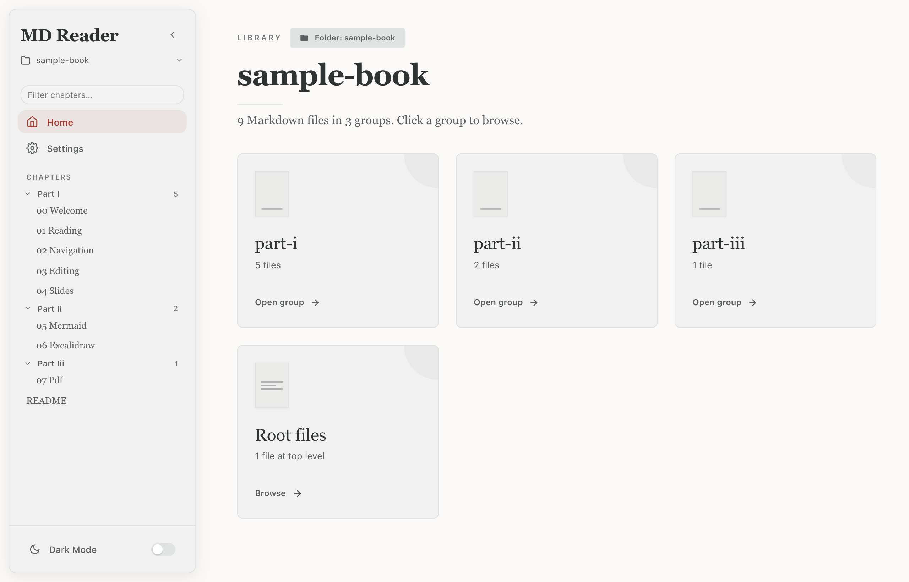
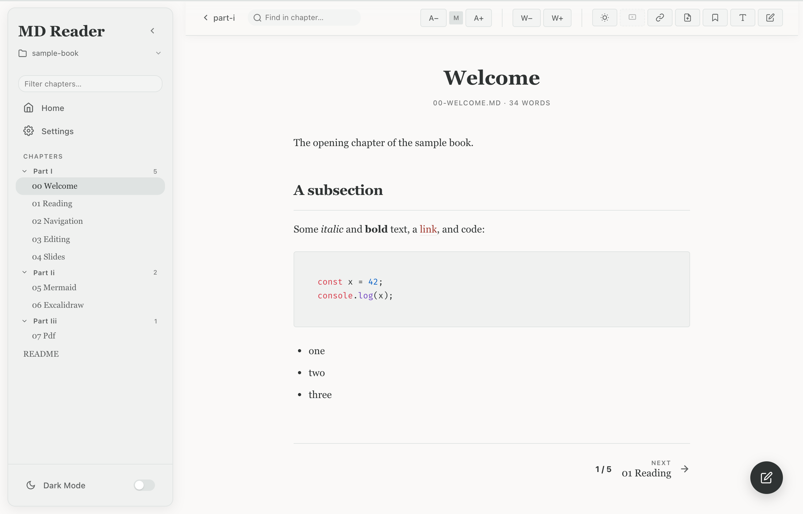
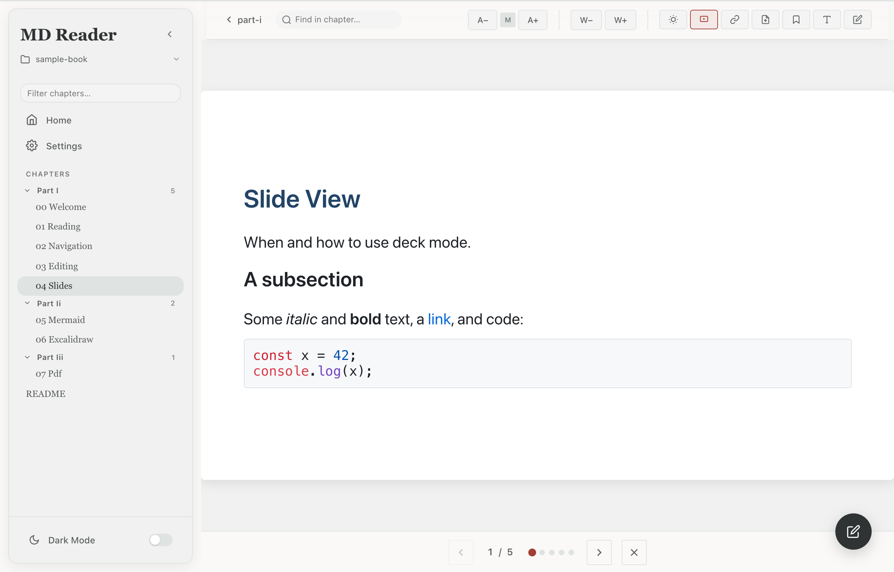
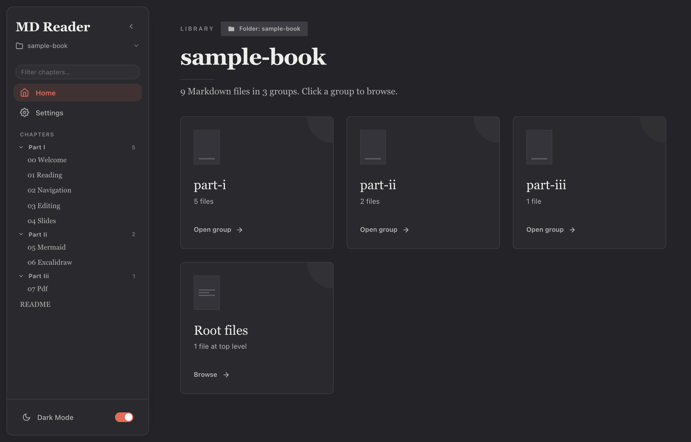
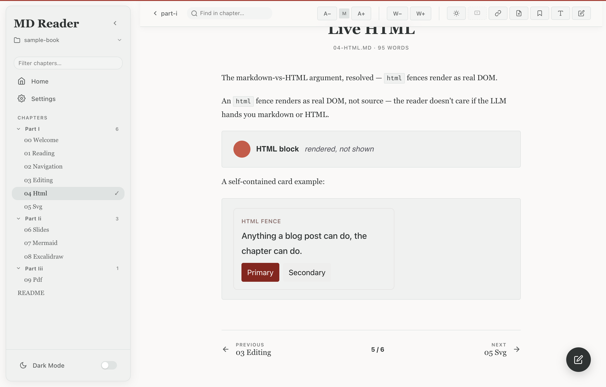
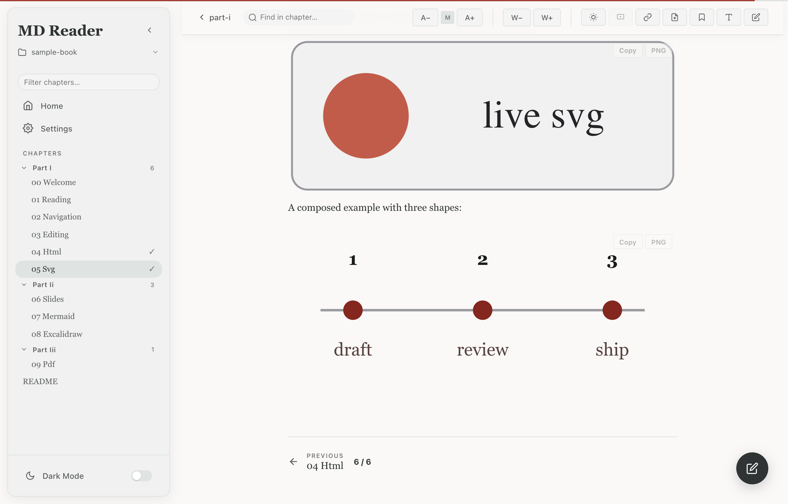
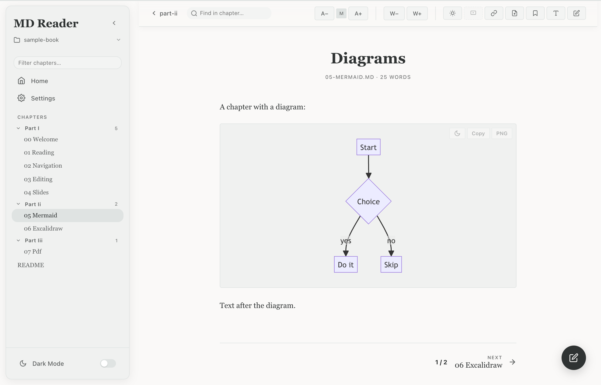

# FenceyMD

> A native desktop Markdown book reader.
> Smaller than Obsidian. Lighter than a notebook.
> Markdown *or* HTML. **Why not both**?



---

## Why FenceyMD

LLMs hand you one of two things: a wall of markdown, or a sea of HTML.
Most readers pick one and stop. FenceyMD picks **neither**. Render
markdown, HTML, and embedded widgets side by side, in a single native
desktop app.

- **Native, not Electron.** ~5 MB DMG vs ~250 MB for Obsidian.
- **Folder = a book.** Pick a directory. Get a sidebar with chapters,
  recents, scroll position, and bookmarks that survive restarts.
- **Slides, diagrams, drawings, PDFs.** Rendered inline, editable
  in place.
- **Offline-first.** No account, no telemetry, no network. Everything
  on disk.

This is the reader for long-form LLM output: drafts, research
notes, books. And the kind you can hand back to an LLM to keep
editing.

---

## At a glance

|  |  |  |
|:---:|:---:|:---:|
| **Read** with editorial typography | **Slides** via Marp fences | **Dark** theme, same shape |

|  |  |  |
|:---:|:---:|:---:|
| **HTML** fences → real DOM | **SVG** fences → the graphic | **Mermaid** diagrams, live |

---

## Features

- **Folder = a book.** Chapters in a sidebar, subfolders become
  chapter groups, recents dropdown keeps your last 10 folders.
- **Reading progress + bookmarks.** Per-file scroll position and
  bookmarks survive reloads and restarts.
- **Markdown + HTML rendered side by side.** No conversion, no
  plugin, no format war.
- **Slide view.** Marp-fenced chapters become a navigable deck.
  Arrow keys step through, Esc exits.
- **Inline Mermaid.** Flowcharts, sequence, ER. Live in the
  chapter.
- **Inline Excalidraw.** Open a drawing canvas, save back to the
  same `.md` file. Editor runtime state stripped; only the
  document survives.
- **Inline CSV.** Drop a ```csv fence, get a real `<table>` —
  first row is the header, the rest is data, the chrome stays
  calm. No interactive grid, no spreadsheet.
- **PDF export.** Headless Chrome renders the live chapter (with
  SVGs inlined) to vector-text PDF.
- **Edit & save.** Swap a chapter into raw-markdown mode, write
  back to disk. Writes are restricted to the folder you opened.
- **Live folder watcher.** External edits show up in the library
  immediately, scroll position preserved.
- **Light/dark, font size, content width, sidebar collapse.**
  Remembered across sessions.
- **Keyboard.** ← / → between chapters. ⌘F in-chapter search.
  ⌘P PDF export. e to edit. Esc to clear.
- **AI-agent control (MCP).** A local, **read-only** MCP server
  (JSON-RPC over HTTP, bound to `127.0.0.1`) lets an AI agent read and
  navigate the reader via seven tools — `open_file`, `get_current_chapter`,
  `get_chapter_content`, `get_selected_text`, `get_book_toc`,
  `capture_screenshot` (the live view as a PNG for a vision LLM),
  and `get_debug_log`. No write tools: an agent can't edit your files
  through the server, and path-traversal is rejected in Rust. Connect an
  agent with **one toggle in Settings → AI agent control** (Claude Code,
  Gemini, OpenCode, Codex); it wires that agent's config to the app's native
  `--mcp-bridge` subcommand (no Node, survives restarts). HTTP-native agents
  can point directly at `http://127.0.0.1:PORT/mcp`. View-changing tools
  (`open_file`, `capture_screenshot`) act on the live window, so it must be
  visible; the read-only data tools work regardless.
  See [`docs/MCP_SETUP.md`](docs/MCP_SETUP.md),
  [`docs/AGENT_REGISTRATION.md`](docs/AGENT_REGISTRATION.md), and
  chapter 13 of the bundled demo for the full tour.

---

## Install

### macOS

Grab `MD.Reader_1.0.0_aarch64.dmg` from the
[Releases page](https://github.com/NgLanNg/fenceymd/releases/latest),
open the DMG, drag **FenceyMD** into Applications.

> **Note:** the release DMG is not code-signed. On first launch
> macOS warns it's from an unidentified developer. Right-click the
> app → **Open**, or run
> `xattr -dr com.apple.quarantine "/Applications/FenceyMD.app"`.

For an **x86_64 (Intel) Mac**, **Windows**, or **Linux** build,
see [CONTRIBUTING.md](CONTRIBUTING.md) for the build path on each OS.

### Build from source

Requires **Node.js 18+** and **Rust** (https://rustup.rs).

```bash
git clone https://github.com/NgLanNg/fenceymd.git
cd fenceymd
npm install
npm run dev          # browser preview at http://localhost:1420
                     # append ?test=1 for the bundled tour book
```

For a desktop bundle:

```bash
npm run build:desktop   # → .app + .dmg (mac) / .msi + .exe (win) / .deb + .AppImage (linux)
```

---

## Use

1. **Pick a folder.** ⌘O, or pick from the recents dropdown in
   the sidebar.
2. **Read.** Click a chapter in the sidebar. ← / → moves between
   chapters. ⌘F searches within a chapter.
3. **Slides.** Click the deck icon in a chapter toolbar. Arrow keys
   step through, Esc exits.
4. **Edit & save.** Click the pencil icon (or press e). Save
   writes back to the file. The folder watcher refreshes on
   external edits too.
5. **Diagrams.** Mermaid blocks render inline. The Excalidraw
   icon opens a drawing canvas; save writes the diagram back into
   the chapter.
6. **PDF export.** The PDF icon (or ⌘P). Headless Chrome renders
   the current chapter with vector text.
7. **Preferences.** Gear icon (top-right). Theme, font, width,
   sidebar collapse. All remembered.
8. **Drive it from an agent.** The MCP server starts the moment
   the app does. The easiest way to connect an agent is
   **Settings → AI agent control**: a per-agent toggle registers
   FenceyMD into that agent's MCP config (Claude Code, Gemini,
   OpenCode, Codex), pointing it at the native `--mcp-bridge`
   subcommand — no Node, no manual port edits. The random port is
   published to a `port` file in the app-data dir
   (`~/Library/Application Support/com.fenceymd.app/port` on macOS)
   and rediscovered on each connection, so the config survives
   restarts. See [`docs/MCP_SETUP.md`](docs/MCP_SETUP.md) for the
   step-by-step setup guide (and [`docs/AGENT_REGISTRATION.md`](docs/AGENT_REGISTRATION.md)
   for per-agent config details), or the bundled chapter
   [13 — Agent Control](demo/13-agent-control.md) for the tour.

The bundled [`demo/`](demo/) is a 14-chapter self-introducing
tour of every feature. Load it with `?test=1`.

---

## More

- [`SNAPSHOT.md`](SNAPSHOT.md) — capture the app window to the
  clipboard. Toolbar button or `⌘⇧S`. Standalone test harness for
  diagnosing capture failures.
- [`DEBUG.md`](DEBUG.md) — the file-based activity log
  (`<app_data_dir>/debug.log`). How to read it, what gets logged,
  recipes for common failures.
- [`DEVLOOP.md`](DEVLOOP.md) — the working loop for changes (build,
  e2e, cargo, bundle, confirm).
- [`STRUCTURE.md`](STRUCTURE.md) — codebase directory structure, files, and architectural map.
- [`docs/MCP_SETUP.md`](docs/MCP_SETUP.md) — step-by-step guide to
  connecting an AI agent (the "start here" for MCP).
- [`docs/AGENT_REGISTRATION.md`](docs/AGENT_REGISTRATION.md) —
  per-agent MCP config snippets (Claude Code, Antigravity,
  OpenCode, Gemini CLI, Codex). Required reading before plugging
  the app into an agent.
- [`ROADMAP.md`](ROADMAP.md) — what's next (v1.1, v2).

---

## Roadmap

**Phase 1 of AI-agent integration is shipped.** The local MCP
server runs in the app and exposes seven tools (`open_file`,
`get_current_chapter`, `get_chapter_content`, `get_selected_text`,
`get_book_toc`, `capture_screenshot`, `get_debug_log`). Agents are
registered with one toggle in Settings → AI agent control
([`docs/AGENT_REGISTRATION.md`](docs/AGENT_REGISTRATION.md)).
**Phase 2** is the in-app sidebar chat (5 agents in parallel,
Tauri-event wired) — designed, not built. **v2** is anchor-based
edit: the user points at a block, the agent returns a surgical
diff, the editor applies it. Both phases are scoped in
`vault/plan/20260613_*_design.md` and depend on v1.1 #23
(stable block IDs everywhere).

---

## License

MIT. See [LICENSE](LICENSE). Copyright (c) 2026 Alan Nguyen.

Built on the work of many — see
[THIRD-PARTY-LICENSES.md](THIRD-PARTY-LICENSES.md) for the full
attribution (445 npm + 527 cargo deps, ~98% permissive). One
transitive dep under EPL-2.0 (`elkjs`, used by mermaid for
graph layout) is noted explicitly there.

To regenerate the file after a dep change:

```bash
npm run licenses
```
