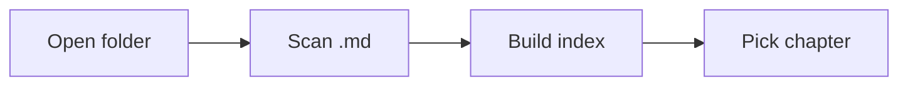
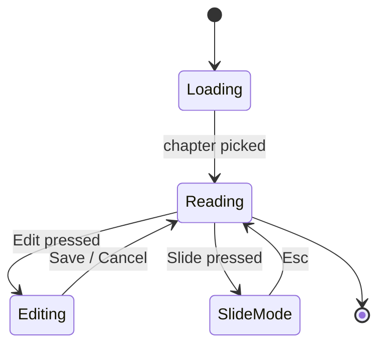

# Two diagram systems, one markdown file

The app renders two flavors of diagram out of the box:

- **Mermaid**: structured diagrams from a fenced code block
- **Excalidraw**: interactive scenes (see the next chapter)

Both are Markdown. No plugin to install, no image to embed.
You write the source, the app renders the picture.

---

# Mermaid

A Mermaid block lives inside a fenced code block with the language
set to `mermaid`:

````markdown

````

The app supports every Mermaid diagram type. The ones you'll reach
for most:

- **`graph`** (or `flowchart`): boxes and arrows
- **`sequenceDiagram`**: actors and messages over time
- **`classDiagram`**: class structure with fields and methods
- **`stateDiagram-v2`**: states and transitions
- **`erDiagram`**: entity-relationship for database schemas
- **`gantt`**: schedules
- **`pie`**: proportions

Mermaid is plain text, so LLMs are good at writing it. Ask for a
flowchart, paste the result, ship.

---

# Reading a Mermaid block

The diagram is rendered below the source. A small toolbar in the
top-right of the rendered image lets you:

- **Copy**: copies the rendered SVG to your clipboard (as an
  image, not text). Paste into any app that accepts images.
- **PNG**: downloads the diagram as a PNG file.
- **☀ / ☾**: toggle light/dark. Each diagram has its own theme
  state, so a single chapter can mix light and dark diagrams.

The toolbar is small, in the top-right, and only appears when you
hover the diagram. It's there when you need it; it's invisible when
you don't.

---

# Why a separate system

Mermaid is great for *structured* diagrams. Anything you could
draw with boxes and arrows if you sat down with a pen for ten
minutes. It's not great for:

- Whiteboard-style sketches with hand-drawn feel
- Diagrams that need to be edited collaboratively
- Freeform spatial layouts

That's what Excalidraw is for. Same Markdown file, different
fence.

---

# A worked example

A state machine, from a real chapter of this app's design docs:



That whole machine fits in nine lines of Markdown. It will be the
exact same nine lines tomorrow, on another machine, in a slide
view, in a PDF export.
